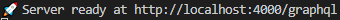
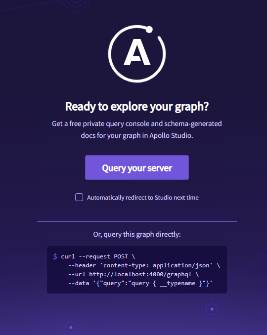
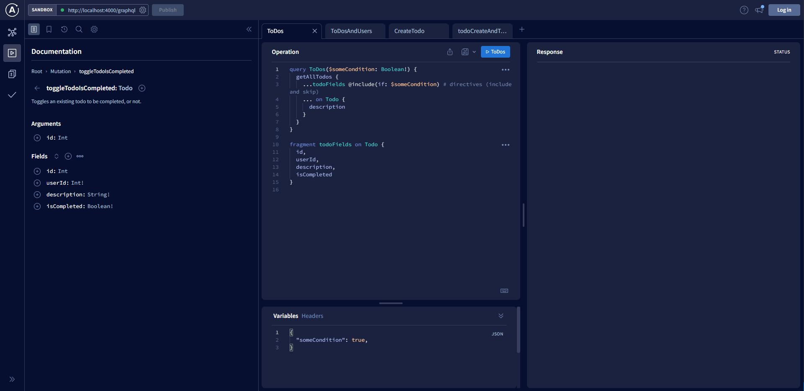

# Things to do
A simple Node API for demonstrating [GraphQL](https://graphql.org/) using [Apollo](https://www.apollographql.com/).


## Getting started
Making sure you are n the project directory `/things-to-do`.

Run `npm install`

Once all dependencies have been installed run `npm run start`

The following should appear



You're ready for Liftoff!

Heading over to `http://localhost:4000/graphql` should display the Apollo GraphQL tool. If you hit the landing page then hit the "Query your server" button.



You should now see the Apollo GraphQL Sandbox Explorer.



This API contains no database so each time you start the service we will be starting from the seeded dummy data.

## Data

This API contains:
### User objects
```js
{
        id: 111,
        name: 'James',
        email: 'james@nothing.com',
        settings: {
            isDeveloper: true,
        }
}
```

and 

### Todo objects
```js
{
        id: 1,
        userId: 111,
        description: 'Make cup of coffee',
        isCompleted: true,
}
```

## GraphQL

You can now start using queries and mutations to interact with the data. The UI should be able to help you construct queries in the panel on the left without needing to write them. If you choose to write them then there is intellisense to help you.

You can also click the Schema button 


To read through the docs.

Some example queries to play with...

```
QUERIES 

query GetAllUsers {
  getAllUsers {
    id
    name
    email
    settings {
      isDeveloper
    }
  }
}

---------------------------------------------------------


query ToDos($someCondition: Boolean!) {
  getAllTodos {
    ...todoFields @include(if: $someCondition) # directives (include and skip)
    ... on Todo {
      description
    }
  }
}

fragment todoFields on Todo {
  id,
  userId,
  description,
  isCompleted
}

-------------------------------------------------------------
query ToDosAndUsers($someCondition: Boolean!) {
# Queries are executed in parallel
  getAllTodos {
    ...todoFields @include(if: $someCondition) # directives (include and skip)
    ... on Todo {
      description
    }
  }

  getAllUsers {
    ...userFields
  }
}

fragment todoFields on Todo {
  id,
  userId,
  description,
  isCompleted
}

fragment userFields on User {
  id,
  email, # Alias?
  name,
  settings {
    isDeveloper
  }
}

MUTATIONS

mutation CreateTodo($userId: Int!, $description: String!) {
  createTodo(userId: $userId, description: $description) {
    ...todoFields
  }
}

------------------------------------------------
mutation todoCreateAndToggle($toggleTodoIsCompletedId: Int, $userId: Int!, $description: String!) {
  # toggleTodoIsCompletedId set this to next int (mutations are executed sequentially)
  createTodo(userId: $userId, description: $description) {
    ...todoFields
  }
  toggleTodoIsCompleted(id: $toggleTodoIsCompletedId) {
    id
    isCompleted
    description
  }
}
```